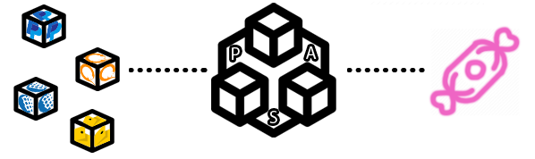
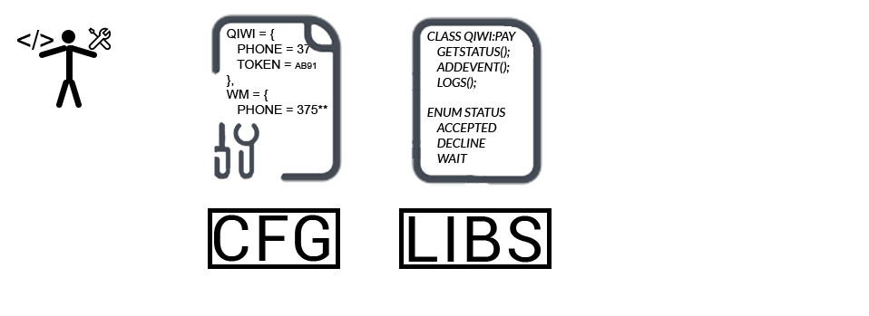

# Требования к Системе Приёма Платежей (Payment Acceptance System или PAS)
---
## 1. Введение
**PAS** — бесплатный веб-фреймворк на [PHP](https://www.php.net) с открытым кодом, решающий задачу приёма платежей различных платёжным систем для Вашего проекта без лишных комиссий, упрощает разработку и задаёт структуру платежей, например:
* Простая интеграция любой платёжки.
* Неободимые базовых моделей.
* Обработчик событий транзакций.
* Админ-панель.

 

PAS доступен, мощный, предоставляет инструменты, необходимые для больших и надежных приложений и просто конфетка.

## 2. Требования пользователя
#### 2.1. Программные интерфейсы
Выразительная, интуитивно понятная база данных ORM использующая [RedBeanPHP](https://redbeanphp.com/index.php). Мощный контейнер для внедрения зависимостей. А так же API самых популярных платёжек [QIWI](https://qiwi.com), [WebMoney](https://www.webmoney.ru), [Яндекс.Денеги](https://yoomoney.ru) и др.
#### 2.2. Интерфейс пользователя

Обширных набор необходимых классов, функций  и конфигураций.
#### 2.3. Характеристики пользователей
* **Программист** уровня от Junior.

*Всё нужное для выполнения Ваших таск [Тут](/).*

#### 2.4. Предположения и зависимости
* Ограниченное время на реализацию

## 3. Системные требования
#### 3.1. Функциональные требования
##### 3.1.1 Конфигурационный файл реквизитов

Это файл с соотвествующими реквизатами плажёк. Для каждой платёжки соотвестующий набор параметров, в зависимсоти от её API.

##### 3.1.2 Конфигурационный файл настроек

Через данный файл задаются настройки системы. Такие, как уровень логирования, данные от входа в админ-панель, список подключенных сервисов. Более тонкие настройки: игнорирование неоплаченного платежа/возврат к неоплаченному платежу.

##### 3.1.3 Функция получения ссылка на оплату

Это функция возвращается ссылку на страницу оплаты, на основание указанного метода оплаты и суммы.

##### 3.1.4 Функция выставление платежа

Функция выставляет платёж на указанные реквизиты. Например, как в QIWI кошельке по номеру телефона.

##### 3.1.6 Обработчик событий
Возможность добавления действий по наступлению события: поступление оплты, неоплата счёта, истечение таймера, пополнение счёта на сумму >= N-сумме.

##### 3.1.7 Функциия получения информации о платеже
Получение информации о платеже из БД по заданным параметрам.

##### 3.1.8 Админ панель
Даннаыя веб-страница предназначенна для администраторов и не трубует спицальных навыков знания запросов БД и языков программирования. Имеется возможность управлять БД с общим интерфейсом не завсющим от движка БД; отслеживание и создание платежей и событий; изменение настроект системы плажей.

#### 3.2. Нефункциональные требования
##### 3.2.1. Атрибуты качества
* Модульные тесты. Они необходимы для обеспечения качества и создания полнофункциональной системы, которую пользователи могут успешно использовать. Будет измеряться тестовым покрытием проекта.
* Удобная структура фреймворка для более легкого и приятного взаимодействия разработчикам.
* Полная документация кода для лёгкого освоения данной технологии.